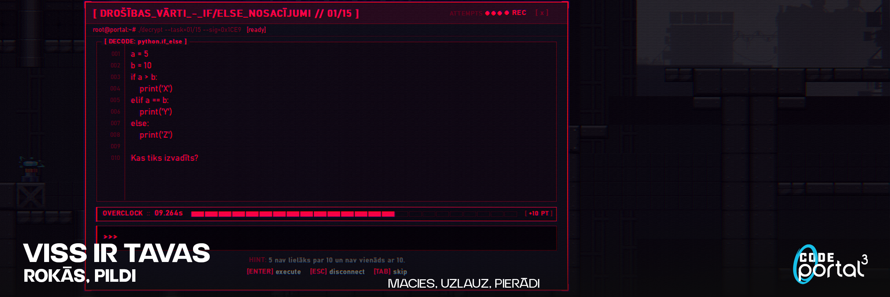
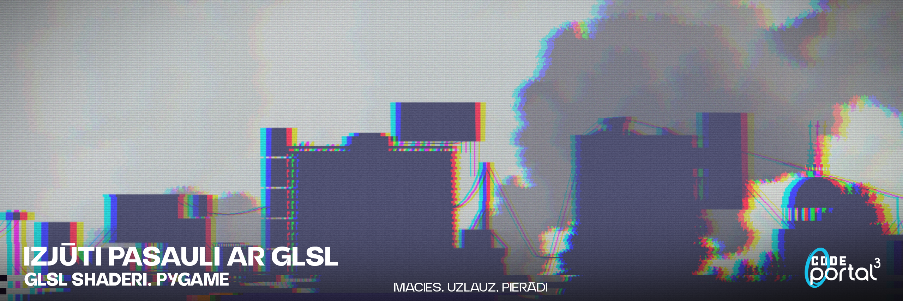

<div align="center">


# CODE Portal³

**Kiberpunka 2D platformer, kur programmēšana ir vienīgais ierocis**

[](https://python.org)
[](https://pyga.me/)
[]()

</div>

---

Tu esi hakeris. Sistēma ir bruņota ar trīs drošības portāliem. Vienīgais veids, kā tos apiet, ir zināt Python. Atrisini uzdevumu, portāls deaktivizējas. Atrodi izeju. Tiec tālāk.

Tas ir kursa darbs, kas izskatās pēc spēles, bet faktiski māca programmēšanu.

---

## Pasaule

<div align="center"></div>

Industriāla kiberpunka vide ar platformer fiziku. Katrā pasaulē ir trīs portāli un durvis, kas atveras tikai pēc visu portālu pabeigšanas.

| Pasaule | Nosaukums    | Portāli                                                   | Mēģinājumi | Overclock |
| :-----: | :----------- | :-------------------------------------------------------- | :--------: | :-------: |
|    1    | INITIATION   | if/else, for/while, funkcijas                             |     3      |  15 sek   |
|    2    | INFILTRATION | Sarežģīti nosacījumi, ciklu kombinācijas, funkciju loģika |     3      |  12 sek   |
|    3    | CORE BREACH  | Algoritmi, datu manipulācija, elite tests                 |     2      |   9 sek   |

Pēc trešās pasaules var turpināt Endless režīmā bez limita.

---

## Hakošana

<div align="center"></div>

Uzskrien portālam un atveras terminālis ar Python koda fragmentu un jautājumu. Tu analizē kodu ar galvu un ievadi atbildi. Nav interneta, nav padomu sākumā. Pēc kļūdas padoms parādās.

Pareizi: portāls izslēdzas, saņem punktus un laika bonusu ja biji ātrs.
Nepareizi: zaudē 5 punktus, redzi padomu.
Kritieni hazardā: zaudē 10 punktus, nomirst dramatiskā raudzenē.

Katram uzdevumam ir trīs mēģinājumi. Punktus skaita šādi: 1. mēģinājums 100 pts, 2. mēģinājums 50 pts, 3. mēģinājums 20 pts. Ja atbildi pirms Overclock taimera beigām, saņem papildu 10 punktus.

---

## Vizuālie efekti

<div align="center"></div>

Spēle izmanto moderngl ar divpakāpju GLSL renderēšanu. Pirmajā solī scēnas shaderis pielieto post-FX: radiālu hromatisko aberāciju, scanlines, neon glow uz spožiem pikseļiem, FBM atmosfēras driftu un vinjeti. Otrajā solī screen shaderis upscale attēlu ar unsharp mask asināšanu. F1 izslēdz visus efektus.

---

## Arhitektūra

Pilna klašu diagramma ar visiem atribūtiem un saitēm atrodas [uml.md](uml.md).

Projekts izmanto četrus OOP principus.

**Iekapsulēšana.** Visi klašu atribūti ir privāti ar `_` prefiksu un pieejami tikai caur metodēm. `PlayerSprite` pārvalda savu fiziku pilnīgi iekšēji, `Game` nekad tieši nepieskaras koordinātēm.

**Mantošana.** `Tile` un `Level` ir bāzes klases ar pilnām hierarhijām:

```
Tile                    Level
├── SolidTile           ├── ConditionLevel   (pasaules 1, 2)
├── PortalTile          ├── LoopLevel        (pasaules 1, 2)
├── HazardTile          ├── FunctionLevel    (pasaules 1, 2)
├── ClimbableTile       ├── AdvancedLevel    (pasaule 3)
└── DoorExitTile        └── ExpertLevel      (pasaule 3)
```

**Polimorfisms.** `draw()`, `verify()` un `to_dict()` metodes ir pārdefinētas katrā apakšklasē. `Game` zina tikai, ka portālam ir `verify()`, bet kas notiek iekšā ir katra `Level` veida pašu lieta.

**Kompozīcija.** `Game` satur `World`, `PlayerSprite`, `Camera`, `Level`, `SoundManager` un `ShaderPipeline` kā neatkarīgus komponentus. Neviens no tiem nezina par otru tieši.

---

## Instalācija

```bash
git clone https://github.com/affecttron/CodePORTAL3.git
cd CodePortal3
pip install moderngl pygame-ce numpy
python main.py
```

Nepieciešams Python 3.10 vai jaunāks.

`moderngl` ir vajadzīgs GLSL post-FX efektiem. Ja tas nav uzinstalēts vai grafiskā karte to neatbalsta, spēle startē bez vizuālajiem efektiem.

---

## Vadība

**Pasaulē**

|       Taustiņš       | Darbība                          |
| :------------------: | :------------------------------- |
| `A` `D` vai bultiņas | Kustība                          |
|   `SPACE` vai `W`    | Lēkt                             |
|       `W` `S`        | Rāpties pa kāpnēm                |
|         `R`          | Respawn                          |
|         `F1`         | Ieslēgt/izslēgt vizuālos efektus |
|         `F9`         | Izlaist pasauli (testēšanai)     |
|        `ESC`         | Iziet                            |

**Uzdevumā**

|  Taustiņš   | Darbība                          |
| :---------: | :------------------------------- |
|  Tastatūra  | Ievadīt atbildi                  |
|   `ENTER`   | Iesniegt                         |
|    `TAB`    | Izlaist typewriter animāciju     |
| `BACKSPACE` | Dzēst (tur nospiestu: ātri dzēš) |
|    `ESC`    | Atcelt un atgriezties pasaulē    |

---

## Third-Party Assets

This project uses third-party assets from the following sources:

**Tileset 1**
https://craftpix.net/freebies/free-industrial-zone-tileset-pixel-art/

**Tileset 2**
https://craftpix.net/freebies/power-station-free-tileset-pixel-art/

**Player Sprite**
https://craftpix.net/freebies/city-man-pixel-art-character-sprite-sheets/

**Music**
https://www.bensound.com/royalty-free-music/track/prism-ambient-suspenseful

These assets are subject to their respective licenses and remain the property of their original creators.

The original asset files are not distributed as part of this repository. Please obtain them directly from the respective sources listed above.

---

<div align="center">

Veidoja **Artūrs Skorikovs** · Komanda **CodePortal3**

</div>
