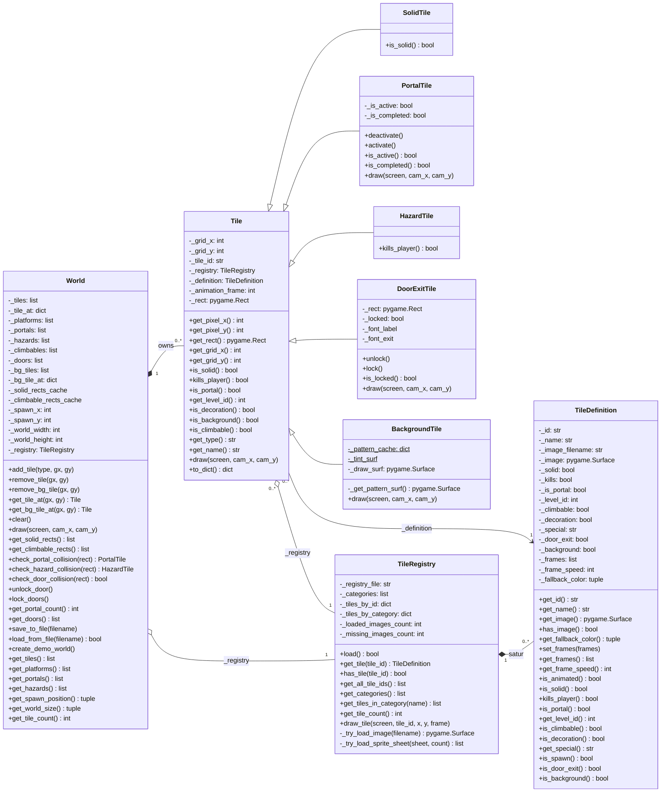
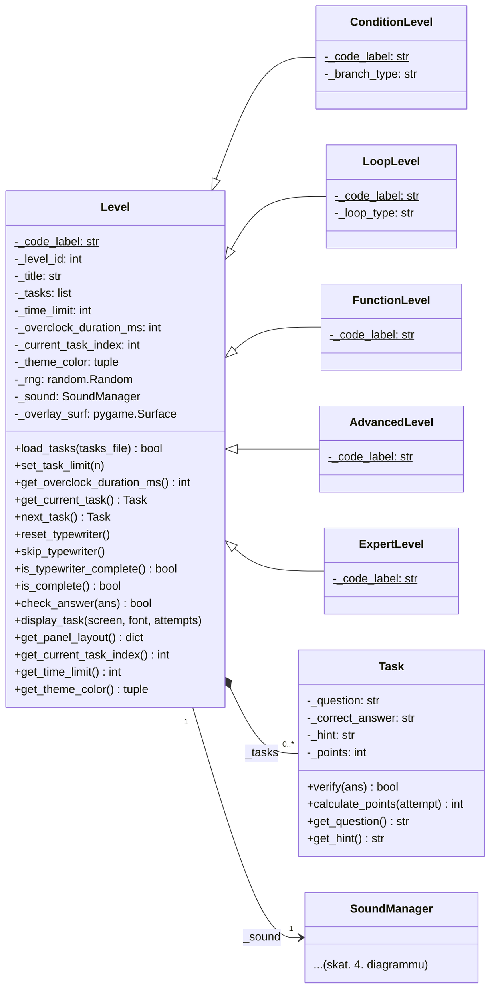
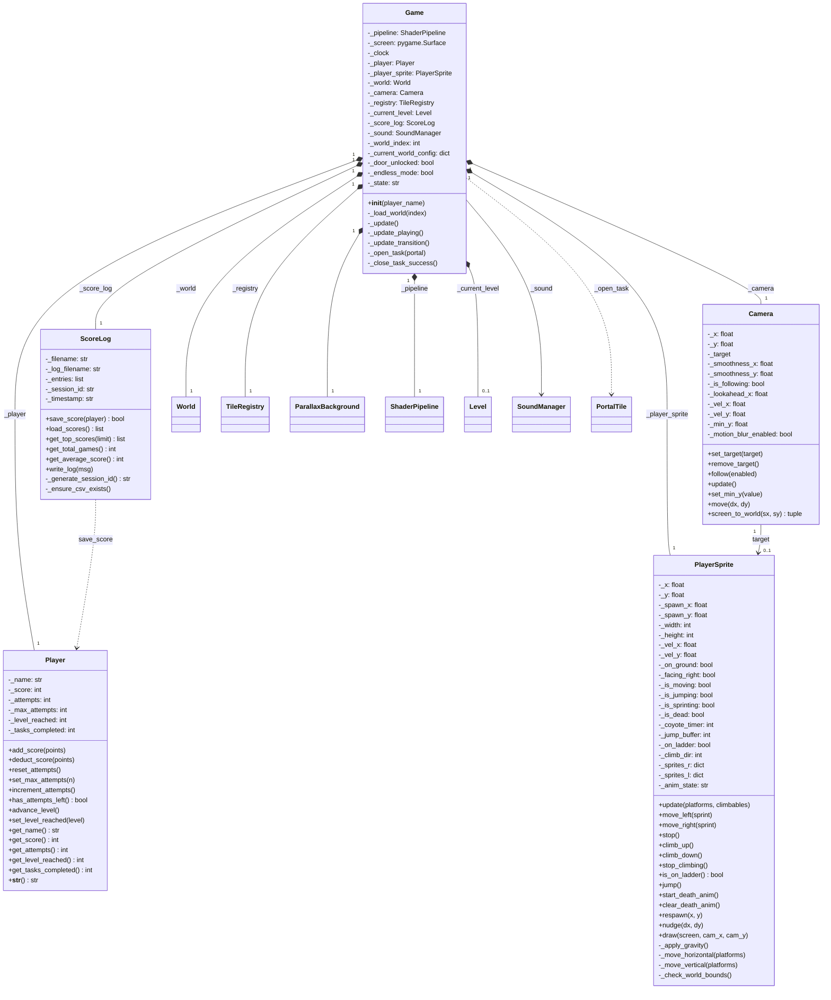
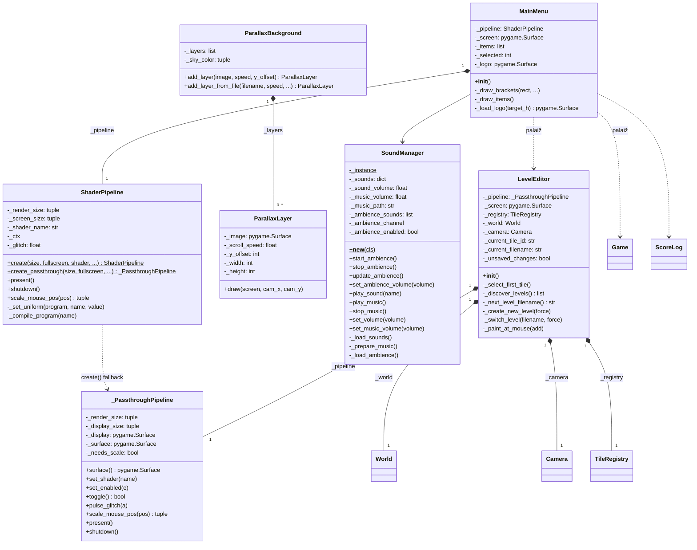

# CODE Portal 3 UML klašu diagramma

Projekta vispārīgs apraksts un spēles mehānikas ir [README.md](README.md).

Viss, kas šeit redzams, nāk no paša koda. Neko klāt neizdomāju. Lai diagrammu būtu vieglāk lasīt un bultas mazāk krustotos, sadalīju to četrās daļās pa moduļiem.

Par apzīmējumiem: `+` ir public, `-` ir private (Python kodā tas ir `_` prefikss priekšā), un `$` apzīmē statisku jeb klases atribūtu. Python redzamību piespiedu kārtā neuztur, tāpēc `protected` (`#`) diagrammā nav. Kodā nav arī īstu interfeisu vai abstraktu klašu, un `enum` tipus neatradu nevienu.

---

## 1. Flīžu (tile) sistēma un pasaule (`tile.py`, `tile_registry.py`, `world.py`)

Te der piebilst: `create_tile(tile_id, gx, gy, registry)` nav klase, bet gan moduļa funkcija. Tā paskatās uz `TileDefinition` karodziņiem un atgriež vajadzīgo `Tile` apakšklasi.

---

## 2. Līmeņi un uzdevumi (`level.py`, `task.py`)

Tāpat arī `create_level(level_id, overclock_ms)` ir tikai funkcija. Tā pēc `_LEVEL_CATALOGUE` tabulas izlemj, kuru līmeņa apakšklasi izveidot.

---

## 3. Spēles kodols un orķestrēšana (`game.py`, `player.py`, `player_sprite.py`, `camera.py`, `score_log.py`)

---

## 4. Renderēšana, audio un ieejas punkti (`shader_pipeline.py`, `parallax_background.py`, `sound_manager.py`, `main.py`, `level_editor.py`)

---

## Galvenās saistības, ko diagramma parāda

1. Kodā ir divas mantošanas hierarhijas. No `Tile` izaug pieci flīžu veidi (`SolidTile`, `PortalTile`, `HazardTile`, `DoorExitTile`, `BackgroundTile`), un no `Level` izaug pieci līmeņu veidi (`ConditionLevel`, `LoopLevel`, `FunctionLevel`, `AdvancedLevel`, `ExpertLevel`). Apakšklases pārraksta `draw()` un citas metodes katra pa savam.
2. Viss turas uz `Game`. Tā izveido un patur gandrīz visus pārējos gabalus (`World`, `PlayerSprite`, `Camera`, `Player`, `TileRegistry`, `ParallaxBackground`, `ScoreLog`, `ShaderPipeline`), un spēles laikā ar `create_level()` ģenerē līmeņus.
3. `World` un `TileRegistry` strādā kopā, tikai dažādi. Pašas flīzes `World` tur kā savu daļu (kompozīcija), bet uz `TileRegistry` tikai norāda (agregācija). Arī katra atsevišķā `Tile` norāda uz to pašu kopīgo `TileRegistry` un uz savu `TileDefinition`.
4. `SoundManager` ir vieninieks (singleton). To panāk ar `__new__` un `_instance`, tāpēc `Level`, `Game` un `MainMenu` visi runā ar vienu un to pašu skaņas objektu.
5. `ShaderPipeline` ir sagatavojusi sev rezervi. Ja `moderngl` nav uzinstalēts, `ShaderPipeline.create()` tā vietā atdod `_PassthroughPipeline`. Tā ir atkarība, nevis mantošana. No malas abas klases izskatās līdzīgi, taču kodā tām nav kopīgas bāzes klases.